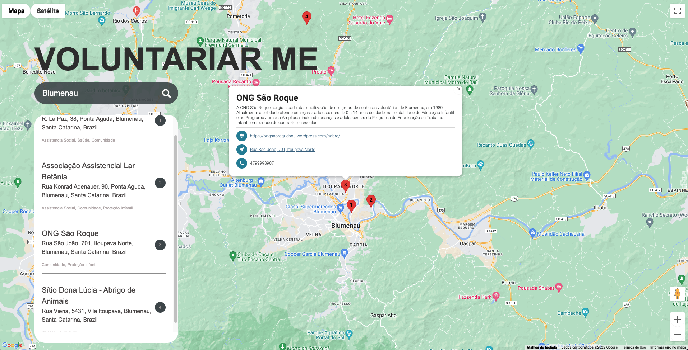

<!-- Inserir descrição do projeto -->
Voluntariarme é um projeto utilizando Ruby on Rails com o intuito de criar uma PoC (Proof of concept) de um localizador de ONGs baseada em sua geolocalização. Dessa forma o visitante do site, recebe uma lista de ONGs cadastradas no Brasil. A partir do momento de pesquisa, irá ser retornado todos os registros de ONGs em um raio de 20 km ou no caso de informar um Estado as ONGs cadastradas no mesmo. 

## Screenshots
<p align="center">
    <h3 align="center">Design</h3>
    
</p>

Tabela de conteúdos
-----------
<!--ts-->
* [Tecnologias](#tecnologias)
* Instalando aplicação localmente
    * [Pré-requisitos](#prerequisites)
    * [Clonando projeto localmente](#clone)
    * [Instalando depêndencias](#install)
* Documentação
<!--te-->


<a href="tecnologias">Tecnologias</a>
-----------
* RAILS 7.0.4
* HTML5
* JAVASCRIPT
* Fontawesome
* Geocoder
* Google Maps Javascript 


Instalando voluntariar-me localmente
-----------

<a href="prerequisites">Pré-requisitos</a>
-----------
`docker`
`docker-compose`
`google-maps-api-key`


Link para documentação oficial de instalação de docker e docker-compose:
https://docs.docker.com/compose/install/

Link para obter as credenciais do google maps: https://developers.google.com/maps/documentation/javascript/get-api-key


<a href="clone">Clonando projeto localmente</a>
-----------

    git clone git@github.com:lucasldemello/voluntariarme.git
    cd voluntariarme

<a href="install">Instalando depêndencias</a>
-----------

Para baixar as imagens e preparar os containers execute o comando:

`docker-compose build --no-cache`

Após a execução, podemos utilizar o seguinte comando para iniciar os containers:

`docker-compose up` ou

`docker-compose up -d` caso queira executar de forma detach (background)

Para iniciar o servidor de cache localmente (dentro do container):

`service memcached start`

Para verificar status do servidor de cash:

`service memcached status`

Para acessar o container:

`docker exec -ti voluntariarme bash`

Criar o banco de dados

`rails db:create`

Rodar migrações antes do primeiro acesso

`rails db:seed`

Para exibir o mapa corretamente é necessário alterar o seguinte trecho com uma variável de ambiente [ENV['MAPS_API_KEY']] ou hard_coded em ```index.html.erb```
```html
<!-- You must replace 'googleMapsAPIKey' with a valid Google Maps API key in order to properly execute -->
<script async        
  src="https://maps.googleapis.com/maps/api/js?key=<%=ENV['MAPS_API_KEY']%>&callback=initMap">
</script>
```
